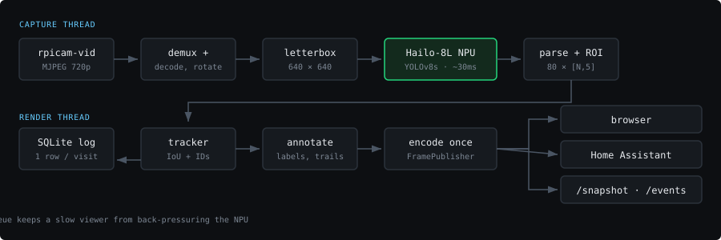

# Hailo Tracker

Real-time object detection and tracking on a Raspberry Pi 5 with a Hailo-8L NPU. Streams annotated video to any browser over HTTP.

Labels every object it sees — all 80 COCO classes, each with its own colour, a confidence score, and a track ID that stays with the object as it moves. Narrow it to just cats, or just people, from the web UI without restarting anything.



## Hardware

- Raspberry Pi 5 (4GB+)
- Hailo-8L AI Kit — M.2 HAT+ or AI HAT+ (13 TOPS)
- Raspberry Pi Camera Module (tested on IMX708 / Camera Module 3 and IMX477 / HQ Camera)

## Features

**Detection**

- ~30 FPS real-time inference on the Hailo-8L
- All 80 COCO classes, per-class colours, cats in green
- Persistent track IDs — "cat #3 was here for 90 seconds", not 2,700 unrelated frames
- Motion trails, confidence thresholding, minimum box size filter
- Region of interest — ignore everything outside a polygon you define

**Interface**

- Live MJPEG stream, no app required
- Control panel: confidence slider, class picker, display toggles — all applied live
- One encode shared by every connected client, so a second browser tab costs nothing
- `/snapshot`, `/stats`, `/tracks`, `/events`, `/metrics`, `/healthz`

**Recording**

- SQLite event log — one row per visit, with duration and peak confidence
- Auto-snapshot on new detection, with retention limits
- Webhook POST on detection, for Home Assistant / Node-RED / whatever
- CSV export

**Operations**

- Self-healing capture loop — a camera hiccup restarts the pipeline with backoff instead of freezing the stream
- Configuration by env file, CLI flag, or the web UI; no need to edit Python
- Prometheus metrics endpoint
- `systemd` service with clean SIGTERM shutdown
- Off-device test harness so you can check changes on a laptop

## Quick Start

```bash
git clone https://github.com/lusher00/hailo-tracker
cd hailo-tracker
./download_model.sh      # fetches yolov8s.hef (~23MB)
./install.sh
```

Open `http://<pi-ip>:8080`.

If HailoRT isn't installed yet, work through [SETUP.md](SETUP.md) first — about 90 minutes on a fresh system, mostly compile time.

## Running by hand

```bash
python3 hailo_tracker.py                          # everything, all classes
python3 hailo_tracker.py --classes cat,dog        # pets only
python3 hailo_tracker.py --conf 0.6 --rotate 90
python3 hailo_tracker.py --snapshots --webhook http://ha.local/api/webhook/cat
python3 hailo_tracker.py --list-classes
```

Full flag list:

| Flag | Effect |
|------|--------|
| `--port N` | HTTP port |
| `--classes a,b` | Class filter |
| `--conf 0.6` | Confidence threshold |
| `--model path.hef` | Use a specific model |
| `--rotate 0\|90\|180\|270` | Camera rotation |
| `--width` / `--height` / `--fps` | Camera capture settings |
| `--no-track` | Per-frame detection only, no IDs |
| `--no-events` | Don't write to the event log |
| `--snapshots` | Save a JPEG per new detection |
| `--webhook URL` | POST detections to URL |
| `--list-classes` | Print all 80 classes with IDs and exit |

## Configuration

Three ways in, highest priority first: **CLI flag → environment variable → default in `hailo_tracker.py`**.

`install.sh` writes `hailo-tracker.env` next to the script and points the systemd unit at it. Edit that file for anything persistent:

```bash
nano hailo-tracker.env
sudo systemctl restart hailo-tracker
```

```bash
TRACKED_CLASSES=cat,dog,person   # empty = all 80 classes
CONF_THRESH=0.40

CAM_WIDTH=1280
CAM_HEIGHT=720
CAM_FRAMERATE=30
CAM_AUTOFOCUS=continuous
CAM_SHUTTER=20000                # microseconds; blank = auto exposure
CAM_GAIN=2

ROTATE_DEGREES=0                 # 0, 90, 180, 270
SNAPSHOT_ON_DETECT=true
WEBHOOK_URL=http://homeassistant.local:8123/api/webhook/hailo
```

The file installed by `install.sh` lists every available setting with comments. Confidence, the class filter, and the display toggles can also be changed live from the web UI — those changes apply instantly but reset to the file's values on restart.

### Camera notes

The defaults come from a build that was pointed at an actual moving cat:

- **1280x720 rather than 1080p.** The network downsamples to 640x640 regardless, so extra pixels only cost JPEG decode and encode time. Raise it if you want a prettier stream and have CPU to spare.
- **`CAM_SHUTTER=20000`** (1/50s) with **`CAM_GAIN=2`** pins exposure. Auto-exposure hunts when a subject crosses the frame, and the resulting motion blur costs real detections.
- **`CAM_AUTOFOCUS=continuous`.** If you set `manual`, you must also set `CAM_LENS_POSITION` (dioptres — `0` is infinity, `2.0` is roughly 50cm). Manual AF with no lens position leaves the lens wherever it was parked, which usually means everything is soft.
- **`CAM_DENOISE=off`** — it adds latency and the network doesn't care.

Outdoors, where light varies a lot, leave `CAM_SHUTTER` and `CAM_GAIN` blank and let the ISP handle it.

### Tracking

The tracker associates detections across frames by IoU overlap, with constant-velocity prediction to ride out brief occlusions.

| Setting | Default | Meaning |
|---------|---------|---------|
| `TRACK_MIN_HITS` | 3 | Frames an object must appear before it counts. Filters the single-frame false positives YOLO throws on textured backgrounds — rugs and blankets love to be "cat". |
| `TRACK_MAX_MISSES` | 15 | Frames to coast a lost object before dropping it. At 30fps that's half a second, enough to survive a chair leg. |
| `TRACK_IOU` | 0.30 | Overlap needed to call two boxes the same object. Lower it for fast movers. |

Set `TRACK_ENABLED=false` (or `--no-track`) for plain per-frame detection with no IDs.

### Region of interest

Ignore everything outside a polygon — a food bowl, a doorway, your own garden but not the pavement:

```bash
ROI_POLYGON=[[0.05,0.4],[0.6,0.35],[0.65,0.95],[0.1,0.95]]
SHOW_ROI=true
```

Coordinates are normalised 0–1, so they survive a resolution change. A detection counts only if its centre falls inside.

## Endpoints

| Path | Returns |
|------|---------|
| `/` | Web UI — live stream plus control panel |
| `/video` | MJPEG stream. Drop into Home Assistant, VLC, or an `` tag |
| `/snapshot` | Latest annotated frame, single JPEG |
| `/tracks` | JSON array of what's in frame right now, with IDs and boxes |
| `/stats` | FPS, inference time, frame and drop counts, per-class totals |
| `/events` | Recent detection events. `?limit=`, `?class=`, `?since=` |
| `/events/summary` | Per-class visit counts and total time in frame |
| `/events.csv` | Full event log as CSV |
| `/snapshots` | Saved snapshot filenames |
| `/snapshots/<name>` | A specific saved snapshot |
| `/metrics` | Prometheus exposition format |
| `/healthz` | 200 if a frame arrived in the last 10s, else 503 |
| `/api/config` | GET current settings; POST to change them live |
| `/api/snapshot` | POST to save the current frame to disk on demand |

```bash
curl -s http://<pi-ip>:8080/stats | python3 -m json.tool
curl -s http://<pi-ip>:8080/events/summary | python3 -m json.tool
curl -o cat.jpg http://<pi-ip>:8080/snapshot

# Switch to cats-only without restarting
curl -X POST http://<pi-ip>:8080/api/config \
     -H 'Content-Type: application/json' \
     -d '{"tracked_classes": ["cat"], "conf_thresh": 0.5}'
```

### Webhook payload

```json
{
  "event": "detection",
  "timestamp": 1754238401.22,
  "iso": "2026-08-03T16:26:41",
  "track": {
    "id": 7, "class": "cat", "class_id": 15,
    "box": [822, 440, 1000, 558],
    "conf": 0.93, "max_conf": 0.94,
    "hits": 12, "duration_s": 0.4, "confirmed": true
  }
}
```

Fired once when a track is confirmed, not per frame. Delivery is fire-and-forget on a background thread — a dead endpoint can't stall the video.

## Event log

One row per track, not per frame:

```bash
sqlite3 events.db \
  "SELECT class, COUNT(*), ROUND(SUM(duration_s)/60,1) AS minutes
   FROM events GROUP BY class ORDER BY 2 DESC;"
```

```
cat|47|182.4
person|12|31.7
dog|3|4.2
```

Rows older than `EVENT_RETENTION_DAYS` (default 30) are pruned hourly.

## COCO Classes

Full list via `python3 hailo_tracker.py --list-classes`. Common ones:

| Class | ID | Class | ID |
|-------|----|-------|----|
| person | 0 | cat | 15 |
| bicycle | 1 | dog | 16 |
| car | 2 | horse | 17 |
| bird | 14 | bottle | 39 |

## Architecture

```
Camera (IMX708 / IMX477)
    ↓ rpicam-vid, MJPEG
capture thread ── JPEG demux → decode → rotate → letterbox 640×640
    ↓
Hailo-8L NPU (YOLOv8s)
    ↓ [80][N, 5] detections
parse → ROI filter → IoU tracker (persistent IDs)
    ↓
render thread ── annotate → encode once
    ↓
FramePublisher ──┬── browser 1
                 ├── browser 2
                 └── Home Assistant
```

Capture and render are separate threads with a depth-2 queue between them, so a slow client or a busy encode can't back-pressure the NPU. The render thread encodes each frame exactly once no matter how many clients are watching.

**Latency is bounded, throughput is not.** `rpicam-vid` never stops producing. If decode plus inference can't keep up with the camera — even briefly — the capture loop discards every buffered frame except the newest before decoding. Falling behind therefore costs you frames, never delay. The alternative (processing every frame in order) means a backlog that grows without limit: at 30fps captured and 20fps processed you accumulate ten frames a second, and after two minutes you're watching twenty-second-old video.

`dropped` in `/stats` counts these. A steady non-zero number is normal and healthy; it means the camera is outrunning the NPU and you're seeing live video rather than a queue. Set `CAM_FRAMERATE` to whatever you actually sustain if you'd rather not waste the encode.

## Files

| File | Purpose |
|------|---------|
| `hailo_tracker.py` | Entry point — config, camera, NPU, Flask |
| `tracker.py` | IoU tracker with velocity prediction |
| `events.py` | SQLite event log, snapshot store, webhooks |
| `webui.py` | The browser UI (single self-contained page) |
| `install.sh` / `uninstall.sh` | systemd service, udev rule, env file |
| `download_model.sh` | Fetches the `.hef` |
| `hailo-tracker.env` | Your settings — created by `install.sh`, gitignored |
| `events.db` | SQLite event log — created on first run, gitignored |
| `snapshots/` | Saved detection frames, if enabled |
| `tests/` | Off-device test harness |
| `doc/` | Diagrams |

## Testing

The harness fakes the camera and the NPU and runs everything else for real, so you can check changes on a laptop before deploying:

```bash
pip install flask opencv-python numpy
./tests/run_tests.sh
```

It verifies the letterbox round trip, track ID stability, live reconfiguration, multi-client streaming, the event log, and clean shutdown. It writes `tests/output_sample.jpg` so you can eyeball the annotation.

## Service Management

```bash
sudo systemctl status hailo-tracker
sudo journalctl -u hailo-tracker -f    # live logs, including detection events
sudo systemctl restart hailo-tracker
./uninstall.sh
```

## Troubleshooting

**`HAILO_OUT_OF_PHYSICAL_DEVICES` (error 74)** — "not enough free devices, requested: 1, found: 0". The count is of *free* devices, not present ones, so this means one of two different things. Check which:

```bash
ls -l /dev/hailo0
```

*No such file* — the driver isn't loaded. Usually a kernel update outran the out-of-tree module; see the next entry.

*It exists* — something already has it open. Only one process can hold the NPU:

```bash
sudo fuser -v /dev/hailo0
systemctl is-active hailo-cat-tracker    # an older service of your own?
```

A crashed instance can keep the handle. Kill the PID `fuser` reports and restart. If you have a second Hailo project installed as a service, disable it — both will start at boot and whichever wins locks out the other, which presents as an intermittent failure.

Note that `sudo hailortcli fw-control identify` succeeding does **not** rule this out. It opens the device only briefly, so it works even when a long-lived process holds it.

**Driver missing after a kernel update** — the most common Ubuntu failure. The Hailo PCIe driver is out-of-tree, so a new kernel arrives without it:

```bash
uname -r
find /lib/modules -name 'hailo_pci*'
```

If those disagree, rebuild for the running kernel:

```bash
sudo apt install -y linux-headers-$(uname -r)
sudo dkms autoinstall -k $(uname -r)
sudo modprobe hailo_pci
```

`dkms status` should list `hailo_pci` for your current kernel. If it doesn't, the driver isn't registered with DKMS and this will break again on the next `apt upgrade` — reinstall it from `hailort-drivers/linux/pcie` so DKMS picks it up.

**`/dev/hailo0` permission denied**

```bash
sudo rmmod hailo_pci && sudo modprobe hailo_pci
```

`./install.sh` writes a udev rule that fixes this permanently. If the node is recreated by something else (a DKMS rebuild, for instance) the rule may not fire:

```bash
sudo udevadm control --reload-rules && sudo udevadm trigger
ls -l /dev/hailo0      # want crw-rw-rw-
```

**Video is minutes behind reality** — you're on a build from before the stale-frame fix. The capture loop now discards all but the newest buffered frame. Confirm `dropped` in `/stats` is climbing while `fps` stays steady; that's correct behaviour. See [Architecture](#architecture).

**`hailo_platform` not found** — use the system Python (`/usr/bin/python3`), not a venv. If you built HailoRT from source the bindings land in `/usr/lib/aarch64-linux-gnu/python3.*/site-packages`; the script adds that path automatically.

**Camera not found**

```bash
rpicam-vid --list-cameras
```

**No `.hef`** — run `./download_model.sh`, or set `HEF_PATH`.

**Boxes in the wrong place** — the model's input size doesn't match `NN_SIZE`. The startup log warns when it can detect this.

**Boxes mirrored across the diagonal** — your model emits `[y1,x1,y2,x2]` rather than `[x1,y1,x2,y2]`. Set `BOX_ORDER=yxyx`.

**Everything's blurry** — see the camera notes; `CAM_AUTOFOCUS=manual` without `CAM_LENS_POSITION` is the usual cause.

**Boxes flicker on and off** — raise `CONF_THRESH`, or raise `TRACK_MAX_MISSES` so the tracker coasts longer.

**False positives on rugs and blankets** — raise `TRACK_MIN_HITS` to 5, and/or `MIN_BOX_AREA_FRAC`.

**Stream stutters with several viewers** — set `STREAM_MAX_FPS=15`, or lower `JPEG_QUALITY`.

**Port 8080 in use** — set `HTTP_PORT`.

More detail in [INSTALL.md](INSTALL.md) and [SETUP.md](SETUP.md).

## Performance

- ~30ms inference per frame on Hailo-8L — this is the floor for yolov8s
- 20–30 FPS end to end at 720p, depending on scene complexity and JPEG size
- ~50–100ms latency, camera to browser
- ~3W NPU power draw
- Tracker overhead is well under 1ms for typical object counts

Where the time goes, in rough order: NPU inference (~30ms, fixed), JPEG decode on the CPU (scales with capture resolution), annotation (scales with object count), JPEG encode (scales with `JPEG_QUALITY`). `/stats` reports `inference_ms` and `encode_ms` separately; whatever's left over between them and your frame time is decode.

To buy frames back: lower `CAM_WIDTH`/`CAM_HEIGHT` first (decode dominates above 720p), then `JPEG_QUALITY`, then `INFER_EVERY_N` as a last resort — the tracker coasts between inferences, so 2 or 3 is usually invisible for slow-moving subjects.

## Roadmap

- [ ] Line-crossing and dwell-time rules
- [ ] Per-class confidence thresholds
- [ ] Multi-camera support
- [ ] Send detection position to a robot controller (BeagleBone Blue)

## License

Copyright (c) 2025 Ryan Lush. Free for personal, educational, and open-source use. Commercial use requires written permission — ryan.lush@gmail.com

## Acknowledgments

Hailo for the accelerator and HailoRT SDK, Ultralytics for YOLOv8, and the Raspberry Pi Foundation.
